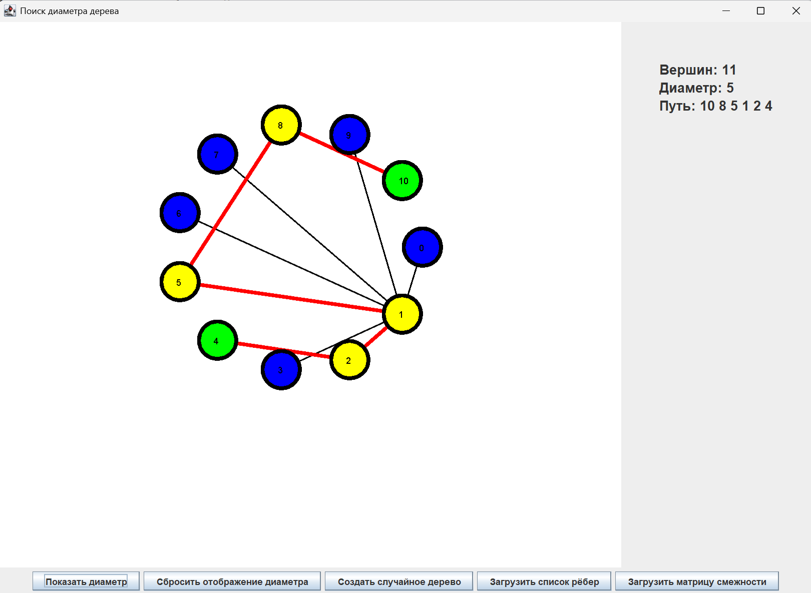

#  Поиск диаметра дерева

## 1. Введение в тему

### 1.1 Цель
    Найти наибольший эксцентриситет в заданном графе 

### 1.2 Способы задания графов
-  Список рёбер
-  Таблица смежности из файла
-  Случайная генерация дерева в программе 

### 1.3 Алгоритм поиска
Для нахождения диаметра ꟷ наибольшего эксцентриситета в дереве был выбран алгоритм DFS,
поскольку он запускается рекурсивно,
что и позволяет найти наиболее удалённые друг от друга вершины. После чего
с помощью алгоритма BFS находится кротчайший путь между ними.
находить искомый диаметр и теперь уже диаметр найден.

## 2. Использование
### 2.1 Запуск программы
    ! Вам необходимо иметь установленную версию java 17+
Поместите файл (исполняемый)
из папки <u>target</u>
-    **tree-diameter-swing-1.0.0-executable.jar** 

и файлы с шаблонами из папки <u>input</u>
-    **tree_edges.txt**
-    **tree_adjacency.txt** 

 в **ОДНУ** директорию, 
после чего откройте в терминале эту директорию и выполните команду:

`java -jar tree-diameter-swing-1.0.0-executable.jar`

- [x] Не забывайте, что можно вручную изменять содержание файлов **tree_edges.txt** (список рёбер)
и **tree_adjacency.txt** (матрица смежности)


### 2.2 Шаблоны 
Шаблон заполнения файла **tree_edges.txt**:

```
7     <-- число вершин
0 1   <-- ребро между 0 и 1 вершиной дерева 
1 2   <-- и т.д.
1 3
2 4
3 5
5 6
```

Шаблон заполнения файла **tree_adjacency.txt**:

```
7               <-- число вершин
0 1 1 1 1 1 1 \
1 0 0 0 0 0 0  \
1 0 0 0 0 0 0   \
1 0 0 0 0 0 0    | <-- таблица смежности дерева    
1 0 0 0 0 0 0   /
1 0 0 0 0 0 0  /
1 0 0 0 0 0 0 /
```

## 3. Результат работы программы



##  Статус проекта

**Версия**: 1.0.1  
**Статус**: Стабильный  
**Последнее обновление**: 2025-12-17

---

[]()